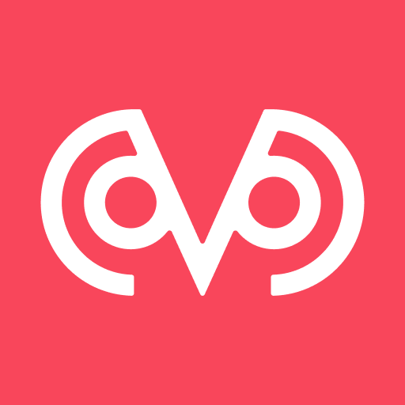
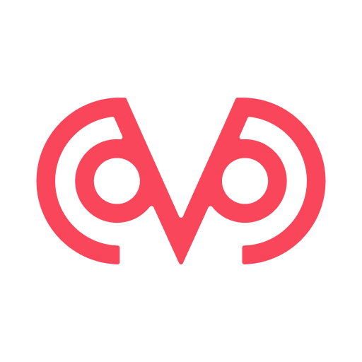
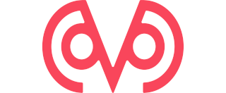

# Branding

Contains resources and usage details about our brand.

GC Brains branding is still a work in progress. What we've decided so far is;

- Brand name;
  - ✅ Correct: GC Brains
  - ⛔ Wrong: G C Brains, G&C Brains, gc brains, GC brains, GCBrains
- Url friendly usage;
  - ✅ Correct: gcbrains
  - ⛔ Wrong: gc-brains, GC-Brains
- Logo is single color, never change it to another one

Thinks we still consider;
  - (oVo) might be used when logo cannot be used

## Social media profiles

Use square logo marks for social media profiles and let them crop it for you.

## Google workspace

Google wants 320x132, but distorts and shows 72x26 in gmail 🤯. So this logo is
distorded on purpose so that gmail shows in the right ratio 🤷.

